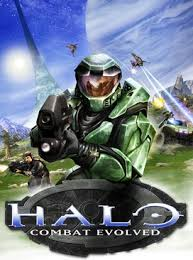

<!DOCTYPE html>
<html lang="es">
<head>
    <meta charset="UTF-8">
    <meta name="viewport" content="width=device-width, initial-scale=1.0">
    <title>Mi Página de Videojuegos</title>
    
</head>
<body>
    <header>
        <h1>Bienvenido a Mi Página de Videojuegos</h1>
    </header>
    <nav>
        <a href="#favorites">Mis Juegos Favoritos</a>
        <a href="#projects">Proyectos de Videojuegos</a>
        <a href="#contact">Contacto</a>
        <a href="#tutorial">Tutorial de Descarga</a> <!-- Nuevo enlace para Tutorial de Descarga -->
    </nav>
    <main>
        <section id="favorites">
            <h2>Juegos del enemigos sin anuncios</h2>
            <ul>
                
                <li><strong>Halo: Combat Evolved</strong> - Un mundo de acción y diversión en el online.</li>
                <!-- Botón de descarga con estilo -->
                <a href="https://www.mediafire.com/file/94tjp1cpa5jc1yy/Halo+CE+-+Neo+Games.rar/file" target="_blank" class="download-link">Descargar desde MediaFire</a>
                <li><strong>The Witcher 3</strong> - Un RPG épico con una narrativa impresionante.</li>
                <li><strong>Need for Speed Most Wanted</strong> - Contraseña: elenemigos.com.</li>
            </ul>
            
            <!-- Botón de descarga con estilo -->
            <a href="https://www.mediafire.com/file/u46iv5di75ggj9l/Need+for+Speed+MW" target="_blank" class="download-link">Descargar desde MediaFire</a>
        </section>
        <section id="projects">
            <h2>Proyectos de Videojuegos</h2>
            
Aquí hay algunos de mis proyectos relacionados con videojuegos:

            <ul>
                <li><strong>Proyecto 1:</strong> Un juego de plataformas en 2D.</li>
                <li><strong>Proyecto 2:</strong> Un juego de rol basado en la fantasía.</li>
                <li><strong>Proyecto 3:</strong> Un juego de estrategia por turnos.</li>
            </ul>
        </section>
        <section id="contact">
            <h2>Contacto</h2>
            
Puedes contactarme a través de mi correo electrónico: moralesjimy29@gmail.com

        </section>

        <!-- Nueva sección de Tutorial de Descarga -->
        <section id="tutorial">
            <h2>Tutorial de Descarga</h2>
            
Sigue estos pasos para descargar el archivo correctamente:

            <ol>
                <li>Haz clic en el botón de descarga proporcionado.</li>
                <li>Una vez descargado, abre el archivo comprimido (si es necesario) en tu dispositivo.</li>
                <li>Realiza la instalación o sigue las instrucciones del archivo.</li>
                <li>¡Listo! Ahora podrás disfrutar del juego.</li>
                <html lang="es">
<head>
    <meta charset="UTF-8">
    <meta name="viewport" content="width=device-width, initial-scale=1.0">
    <title>Mi Página de Videojuegos</title>
    

    <main>
        <section id="video">
            <h2>Video Tutorial de halo</h2>
            
A continuación, te dejamos un video tutorial sobre cómo instalar y jugar los videojuegos.

            <!-- Video Embebido -->
            <video controls>
                <source src="tutohalo.mp4" type="video/mp4">
            </ol>
        </section>
    </main>
    <footer>
        
&copy; 2024 Mi Página de Videojuegos

    </footer>
</body>
</html>
